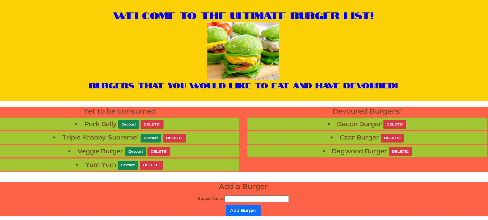

# Eat_Da_Burger
## Description 

This is a CWRU coding bootcamp homework assignment practicing Node.js, express with express-handlebars.  The project tests the students ability to incorporate the NPM express with express-handlebars into their code.  The project also incorporates using a mySQL database and utilizing ORM to implement quaries.  The project practices the ability to get, post, and delete documents to a JSON and be able to store them and delete them using ORM.  This project utilizes the MVC (Model-View-Controller) file set up.  The project also incorporates the ability to deploy an app onto heroku.

AS A USER I would like a simple application that I can generate a list of burgers I want to eat and the burgers that I have eaten.  I want to be able to add additonal burgers and delete them if needed.

## Table of Contents

* [Installation](#installation)

* [Usage](#usage)

* [Contributions](#contributions)

* [Tests](#tests)

* [License](#license)

* [Questions](#questions)

* [Future](#future)

* [Contact](#contact)

## Installation
node.js, NPM express, express-handlebars, mySQL

## Usage
The project is used for creating a list of burgers one has eaten or plan on eating in the future: https://murmuring-taiga-63819.herokuapp.com/ 

Deployed Site

## Contributions
Jordan Rantucci

## Tests
This project uses express to save and store the information.

## License 
 

# Questions
See Contact Section

# Future
Update the styling to personalize the notebook

# Contact

GitHub username: jordanrantucci and Email address: jordanrantucci@gmail.com
